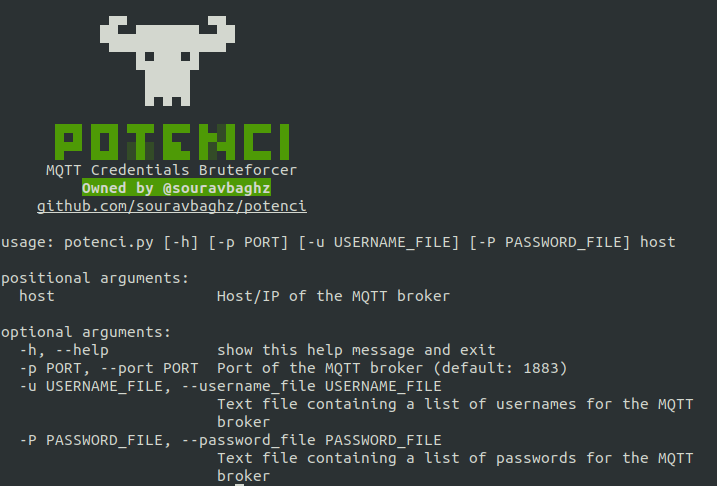

<p align="center">
  
</p>

<h2 align="center"><b>MQTT Credentials Brute Forcer</b></h3> 

#### Installation:
 ```
 git clone https://github.com/souravbaghz/potenci
 cd potenci
 pip3 install -r requirements.txt
 ```
 #### Usage examples:
 ```
 python3 potenci.py -h 
 python3 potenci.py 127.0.0.1 -u users.txt -P pwd.txt 
 python3 potenci.py mqtt.broker.xyz -u users.txt -P pwd.txt
 ```
 -h, --help #For Help Menu
 
 #### Results:
<p>
  
</p>
