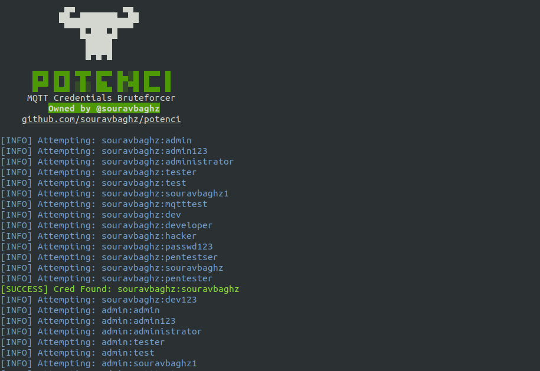

<p align="center">
  
</p>
<h2 align="center"><b>MQTT Credentials Brute Forcer</b></h3> 

#### Installation:
 ```
 git clone https://github.com/souravbaghz/potenci
 cd potenci
 pip3 install -r requirements.txt
 ```
 #### Usage examples:
 ```
 python3 potenci.py -h 
 python3 potenci.py 127.0.0.1 -u users.txt -P pwd.txt 
 python3 potenci.py mqtt.broker.xyz -u users.txt -P pwd.txt
 ```
 -h, --help #For Help Menu
 
 #### Results:
<p>
  
</p>

 ***
 
 ### If You Do Love My Works Then You Can Buy Me A Coffee Now.
 <a href="https://www.buymeacoffee.com/souravbaghz" target="_blank"></a>
 
 <br>
 
### 🤝 Connect with me
[](https://www.instagram.com/souravbaghz)
[](https://github.com/souravbaghz)
[](https://twitter.com/souravbaghz)
[](https://medium.com/@souravbaghz)

---
